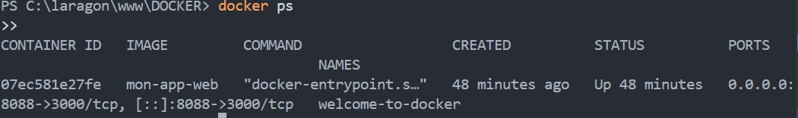
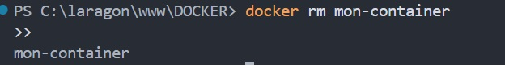
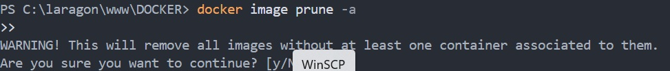
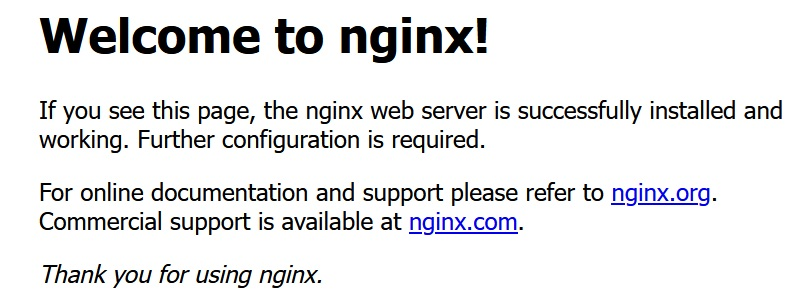

- docker version
  
  - docker info
  
- docker ps
  
  - docker images
  
- docker run
  

- docker stop
  

- docker pull
  
- docker images 2
  
- docker version
  
  - docker info-2
    
- docker ps-2
  
- docker ps-a
  

  - docker images 3
    
  - docker run-2
    
  - docker stop-2
    

  - docker rm mon-container
    

- docker rm mon-container wizardly_greider
  

  -- docker container prune
  

  - docker image prune -a
    

  - docker rmi hello-world nginx ubuntu
    
    - docker run -it --rm -p 8081:80 nginx
  

    
