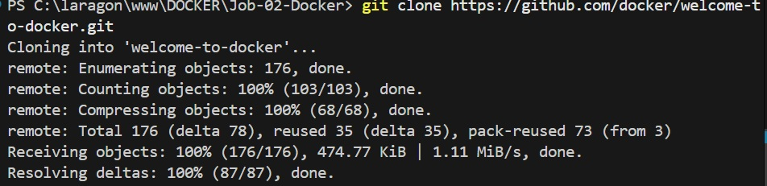
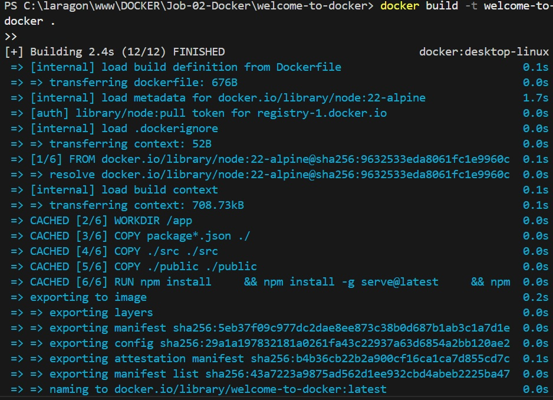
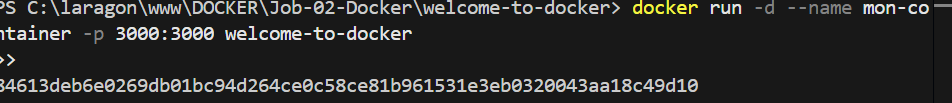
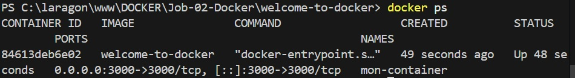
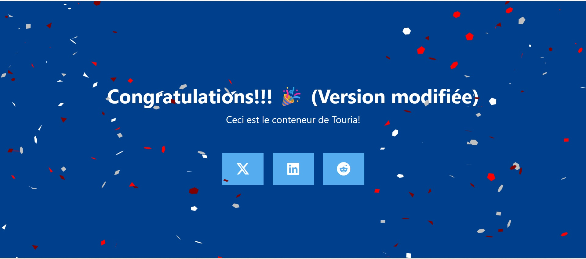
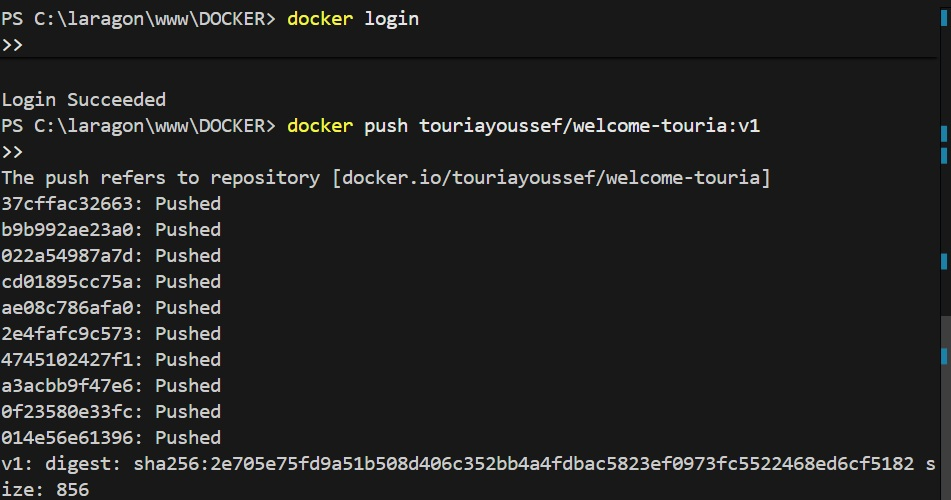

- docker clonage
  

  - Creation de l'image welcome-to-docker
    
    Lancer un container avec cette image
    
    -verification s'il est lancé
    
    verification page
    

  -Modification de App.js -> Build de nouvelle image -> run un nouveau conteneur avec la nouvelle image
  

- Push la nouvelle image sur dockerhub:
  

  - Recuperation de l'image khalyahmad
    

    - Run conteneur sur l'image khalyahmad

  
