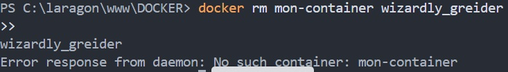
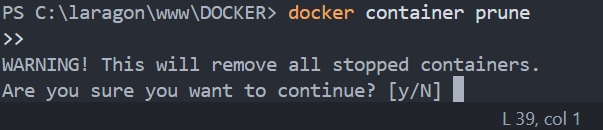
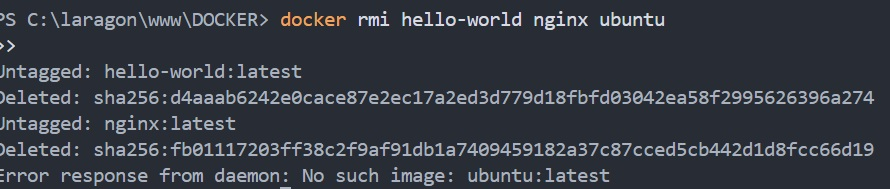

- docker info
  
- docker version
  
- docker ps
  
- docker run
  

- docker stop
  
- docker images
  
- docker pull
  
- docker images 2
  
- docker version
  
  - docker info2
    
- docker ps2
  
- docker ps -a
  
  - docker images 3
  
  - docker run2
  
  - docker stop2
  
   
  - docker rm mon-container
  

- docker rm mon-container wizardly_greider
  

 -- docker container prune
  

  - docker rmi hello-world nginx ubuntu
  

  - docker image prune -a
  

   

  
  

  
