- Recherche de l'image sur docker hub:
  

- Recuperation de l'image:
  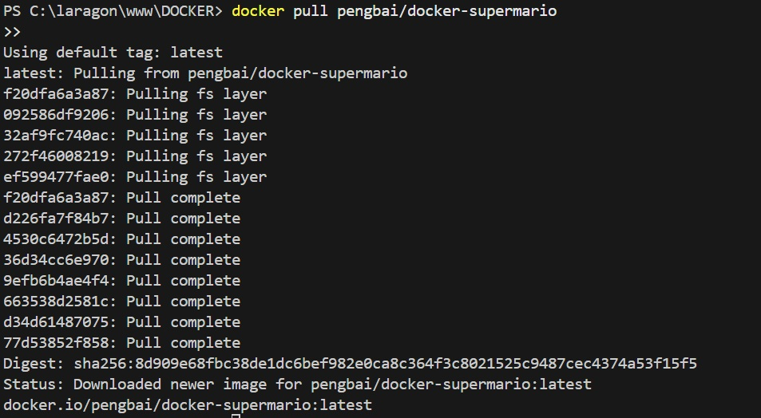

- Image disponible dans la liste des images locales:
  

- Run l'image:
  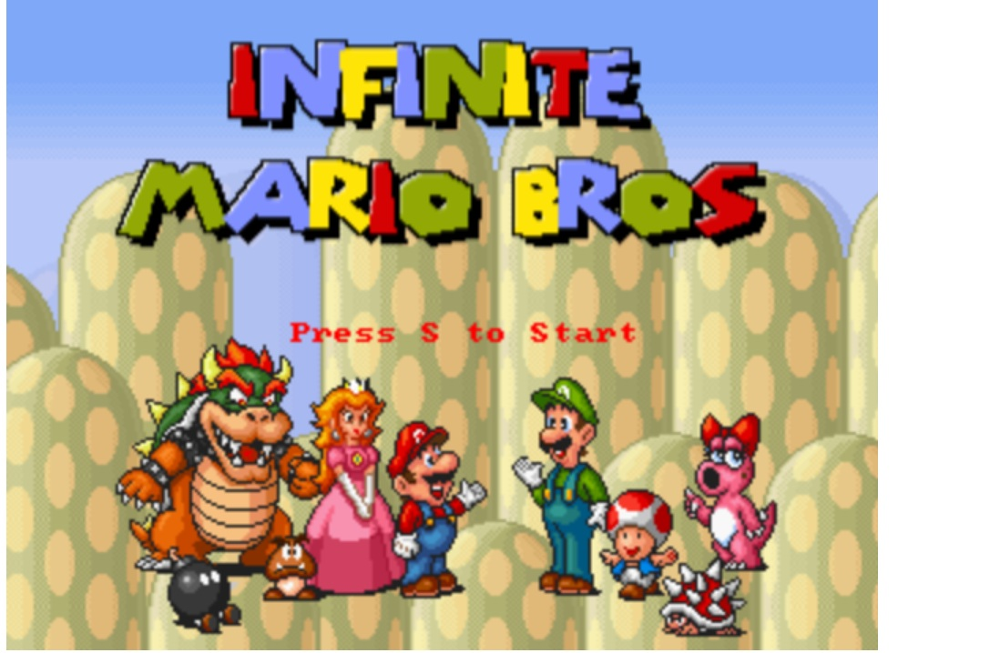
  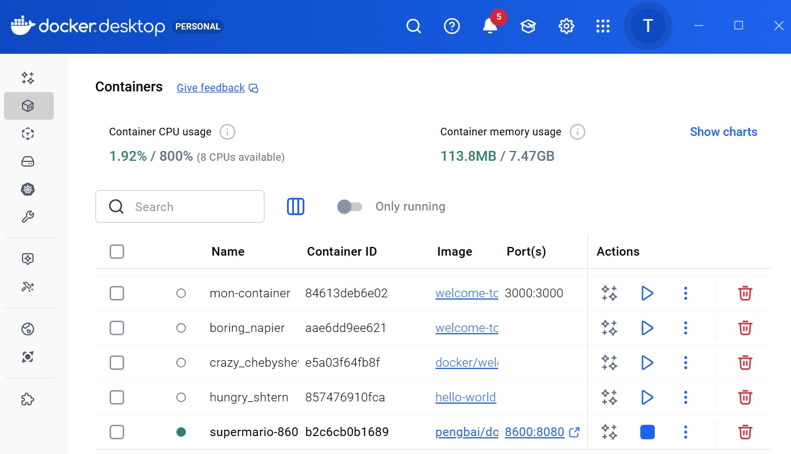
  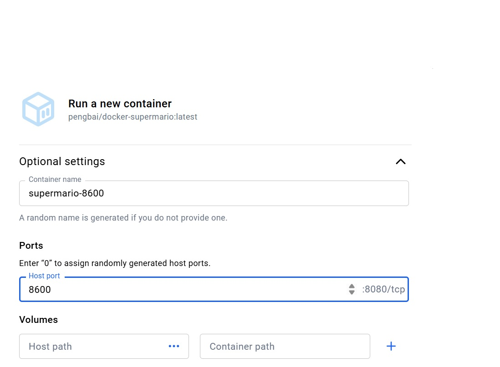

- Usage avec 1 et 2 conteneurs demarrés:
  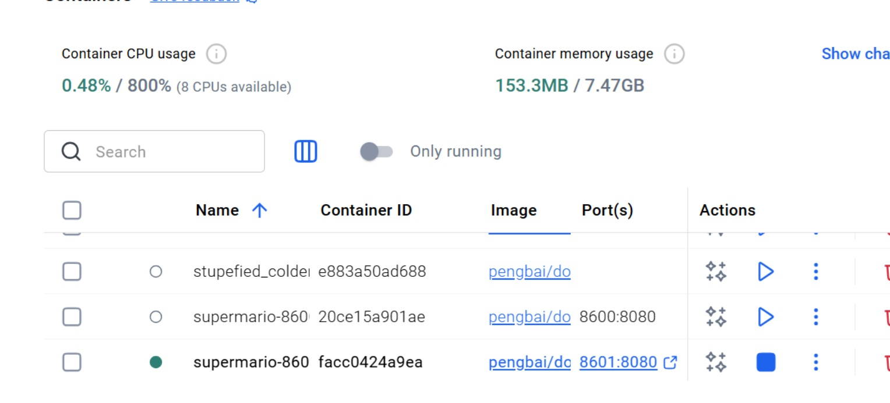
  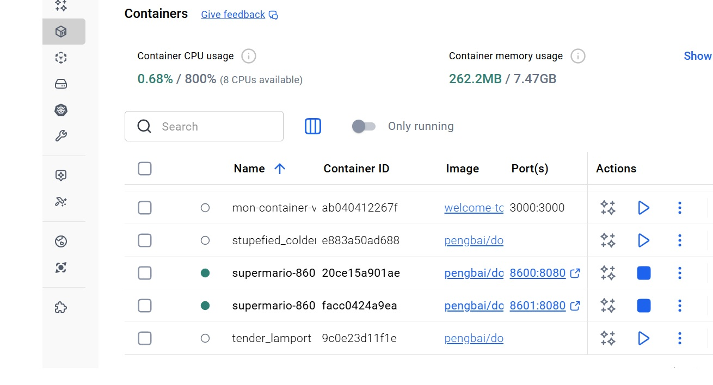

- Gameplay:
  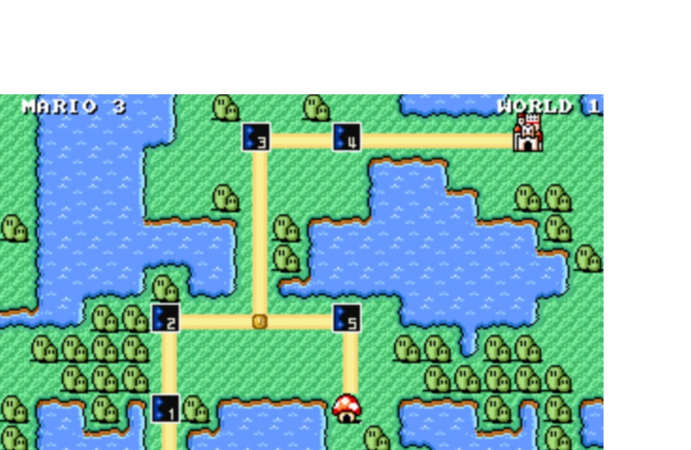
  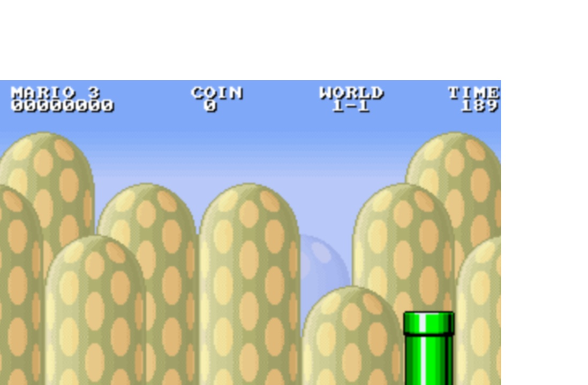
  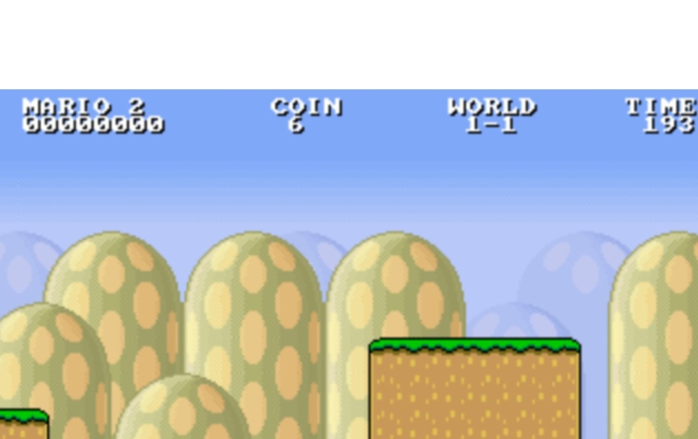

- 2 Façons de trouver l'id:
  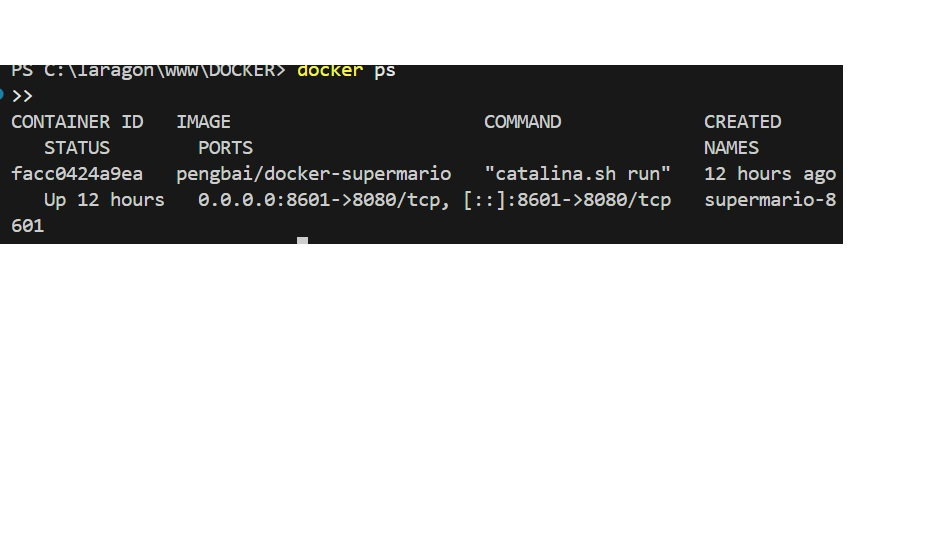
  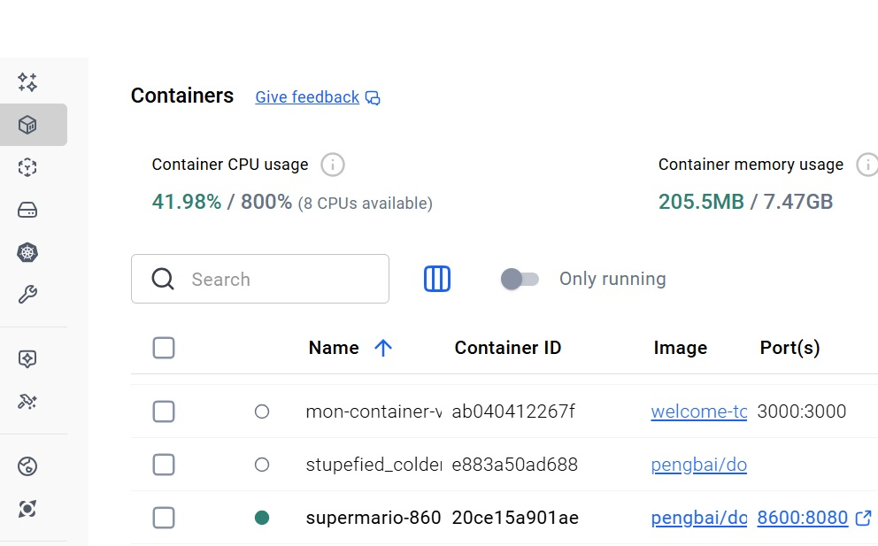

- Arret des conteneurs
  
  

- Utilisation apres arret
  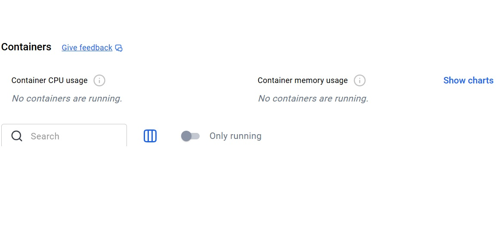

- Suppresion des conteneurs:
  
  

- Suppresion de l'image:
  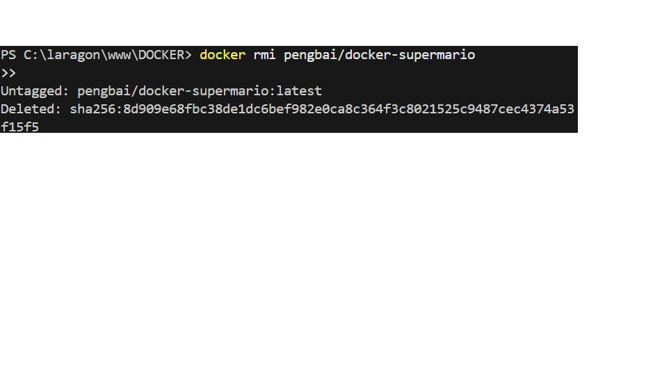
  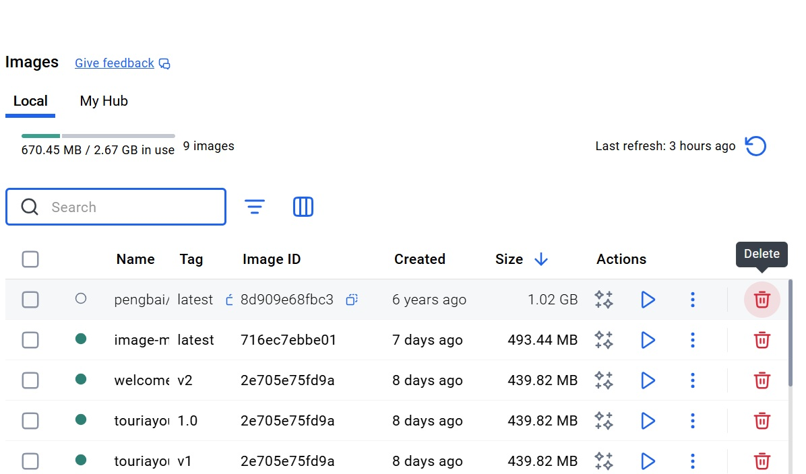
