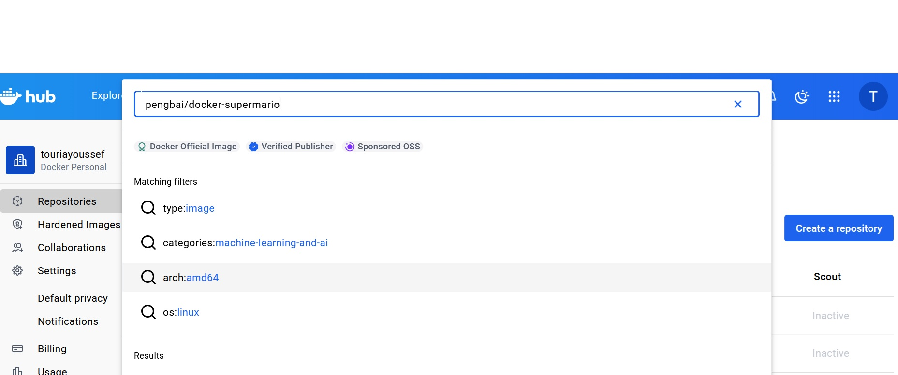
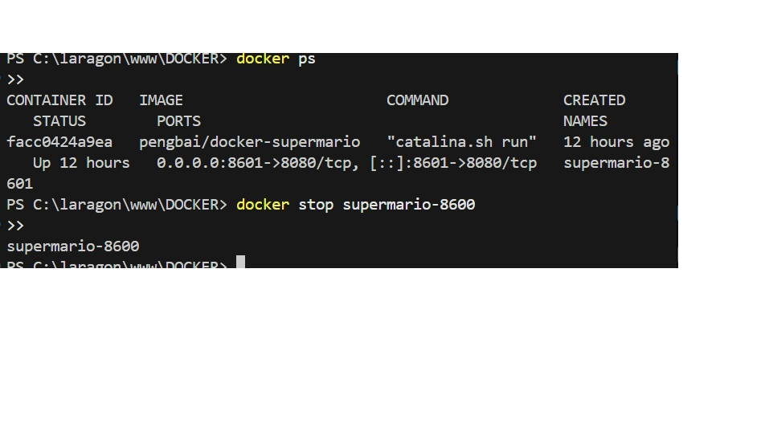
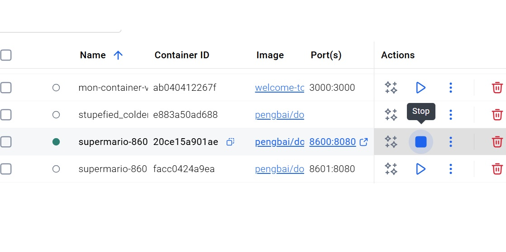
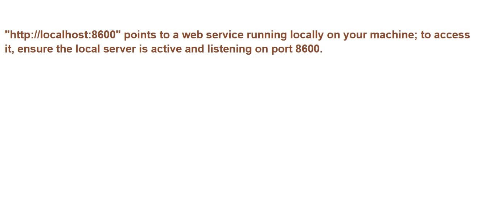

# Super Mario – Docker (pengbai/supermario)

## 1) Recherche de l'image sur Docker Hub
Objectif : vérifier que l’image existe sur Docker Hub avant de la récupérer.

## 2) Récupération (pull) de l'image
Commande utilisée : `docker pull pengbai/supermario`
Résultat : téléchargement de l’image en local.

## 3) Image disponible dans la liste des images locales
Commande utilisée : `docker images`
Résultat : l’image `pengbai/supermario` apparaît dans la liste.

## 4) Run de l'image (lancer un container sur le port 8600)
Objectif : exposer le container (8080) sur le port 8600 de la machine.
Commande (terminal) : `docker run -d --name supermario-8600 -p 8600:8080 pengbai/supermario`

### Résultat dans Docker Desktop (container créé et démarré)

### Deuxième container lancé sur un autre port
Exemple : `docker run -d --name supermario-8601 -p 8601:8080 pengbai/supermario`

## 5) Usage avec 1 et 2 conteneurs démarrés
Vérification : accès via navigateur.
- 1 container : `http://localhost:8600`
- 2 containers : `http://localhost:8600` et `http://localhost:8601`

## 6) Gameplay (au moins 3 captures)

## 7) Trouver l'ID du container (2 façons)
Méthode 1 : `docker ps`

Méthode 2 : Docker Desktop > Containers (ID/Name visible)

## 8) Arrêt des conteneurs
Commande (terminal) : `docker stop <CONTAINER_ID>` (ou `docker stop supermario-8600`)

Arrêt via Docker Desktop (bouton Stop)

## 9) Vérification après arrêt
Résultat attendu : le jeu n’est plus accessible (container stoppé).

## 10) Suppression des conteneurs (2 façons)
Terminal : `docker rm <CONTAINER_ID>` / `docker rm supermario-8600`

Docker Desktop : Containers > Delete/Remove

## 11) Suppression de l'image (2 façons)
Terminal : `docker rmi pengbai/supermario`

Docker Desktop : Images > Remove

